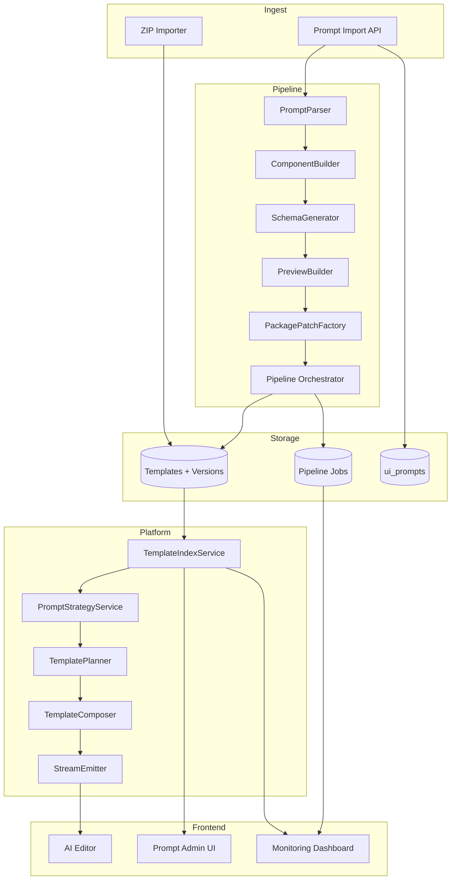

# Design Document

## Overview

该方案在既有模板导入体系上扩展 6 大阶段能力：双源（ZIP + 提示词）入库、提示词驱动的模板生成流水线、模板知识库索引、AI 建站编排器、前端与工具链改造以及测试运维体系。整体由后台流水线服务、AI 编排服务、模板索引服务与前端管理/生成体验组成，确保模板资产从采集、加工、审核到生成上线的闭环可追踪、可回滚。

## Steering Document Alignment

### Technical Standards (tech.md)
当前仓库未提供 tech.md；设计沿用现有 Node.js + Express + TypeScript 后端、Vite + React 前端、Prisma + Postgres 的技术栈，并遵循服务分层、模块化与类型共享（`shared/types.ts`）的既定实践。

### Project Structure (structure.md)
未发现 structure.md；所有新增代码遵循既有目录约定：后端置于 `backend/src`（拆分 services/routes/middleware/scripts）、前端置于 `frontend/src`（components/pages/stores/services），共享类型补充 `shared/types.ts`。流水线与 AI 相关新模块将落在 `backend/src/services` 下独立子目录，CLI/脚本进入 `server-scripts/`。

## Code Reuse Analysis

### Existing Components to Leverage
- **backend/src/services/importer/zipImporter.ts**：复用并扩展 ZIP 目录校验、预览生成与 slug 逻辑。
- **backend/src/services/templateIndex.ts**：作为模板索引基础，扩展以支持多类型聚合与摘要缓存。
- **backend/src/services/templateExporter.ts / templateVersioning.ts**：复用版本管理与打包工具，纳入自动流水线输出的模板。
- **frontend/src/pages/TemplateLibrary.tsx**：扩展为展示索引摘要、标签与监控统计的基线页面。
- **frontend/src/components/AiEditor/** 现有 AI 编辑器组件（若已存在）；否则参考现有对话式生成实现。

### Integration Points
- **Prisma + Postgres**：新增 `ui_prompts`、`prompt_generation_runs`、`template_pipeline_jobs` 等表并扩展 `Template`/`TemplateVersion`。
- **/api/templates/** 路由组：新增提示词上传、流水线任务、索引摘要、AI 编排相关端点。
- **AI Provider Service**（`backend/src/services/ai/*`）：复用统一的大模型调用封装，引入新的系统提示与流式输出。
- **Monitoring & Logging**（`backend/src/services/logger.ts`、`backend/src/services/metrics.ts` 若已存在）：扩展埋点与告警钩子。

## Architecture

整体采用事件驱动 + 工作流编排：提示词经解析后生成组件模板，统一导入模板库，并同步索引与提示策略；AI 编排器实时读取索引结合用户上下文生成站点方案，前端消费流式结果。关键模块：
- 入库层：ZIP Importer、Prompt Importer。
- 流水线层：PromptParser、ComponentBuilder、SchemaGenerator、PreviewBuilder、PackagePatchFactory、PipelineOrchestrator。
- 支撑层：TemplateIndexService、PromptStrategyService、VersioningService、AuditService。
- AI 编排层：TemplatePlanner、TemplateComposer、StreamEmitter。
- 前端 & 工具链层：AI 编辑器、提示词管理后台、依赖合并 CLI、监控看板。

### Modular Design Principles
- **Single File Responsibility**：每个 service 仅聚焦单一能力，如 `promptParser.ts` 仅负责解析 Markdown。
- **Component Isolation**：流水线步骤拆分为独立模块，通过 orchestrator 组合，便于替换单步实现。
- **Service Layer Separation**：路由只承担入参校验与调用 service；service 调用 repository 层处理数据。
- **Utility Modularity**：依赖补丁、预览渲染、schema 生成等通用逻辑提炼到 `backend/src/utils/templates/`。



## Components and Interfaces

### Prompt Import API (`backend/src/routes/prompts.ts`)
- **Purpose:** 接收批量 JSON/Markdown 提示词，写入 `ui_prompts` 并触发流水线。
- **Interfaces:** `POST /api/prompts/import`, `GET /api/prompts/:id`, `POST /api/prompts/:id/retry`。
- **Dependencies:** Prisma client、PromptParser、PipelineOrchestrator、logger。
- **Reuses:** 复用现有路由注册与中间件（auth、schema 校验）。

### PromptParser (`backend/src/services/pipeline/promptParser.ts`)
- **Purpose:** 将 Markdown/JSON 提示拆解为主组件、Demo、依赖文件、CSS、npm 依赖、实施指南。
- **Interfaces:** `parse(markdown: string): ParsedPrompt`。
- **Dependencies:** Markdown AST (`remark`/`markdown-it`)、自定义语法规则、`shared/types.ts`。
- **Reuses:** 现有 HTML/CSS 解析工具（若有）。

### ComponentBuilder (`backend/src/services/pipeline/componentBuilder.ts`)
- **Purpose:** 基于解析结果生成组件源码、demo、静态资源。
- **Interfaces:** `build(parsed: ParsedPrompt, opts): ComponentBuildResult`。
- **Dependencies:** 文件模板（Handlebars）、`fs/promises`（受控写入 TMP）、Asset 管理工具。
- **Reuses:** 现有组件模板片段（`frontend/src/components`）、shadcn 组件库。

### PackagePatchFactory (`backend/src/services/pipeline/packagePatchFactory.ts`)
- **Purpose:** 生成 `PackagePatch`、`StylePatch`，避免重复依赖。
- **Interfaces:** `create(existingDeps, newDeps): { packagePatch, stylePatch }`。
- **Dependencies:** `package.json` 读取、Tailwind 配置、shadcn 注册表。
- **Reuses:** 依赖解析工具 `backend/src/utils/deps.ts`（若存在）。

### SchemaGenerator (`backend/src/services/pipeline/schemaGenerator.ts`)
- **Purpose:** 从状态/常量生成 `schema.json`、默认数据。
- **Interfaces:** `generate(parsed: ParsedPrompt): { schema, defaults }`。
- **Dependencies:** JSON schema builder、TypeScript AST（可选）。
- **Reuses:** 现有 schema 生成逻辑（若有）。

### PipelineOrchestrator (`backend/src/services/pipeline/orchestrator.ts`)
- **Purpose:** 串联解析、组件生成、依赖处理、预览构建、ZIP 打包与导入 API。
- **Interfaces:** `run(jobId)`、`enqueue(promptId)`、`retry(jobId)`。
- **Dependencies:** `bullmq`/`bee-queue`（如需异步）、`zipImporter`、`templateVersioning`。
- **Reuses:** 上传导入 API 与版本管理 service。

### TemplateIndexService (`backend/src/services/templateIndex.ts` 扩展)
- **Purpose:** 聚合模板摘要、标签、用途，暴露搜索接口与索引刷新。
- **Interfaces:** `refresh(templateId)`, `getSummary(filters)`, `onTemplateImported(event)`。
- **Dependencies:** Prisma、缓存（Redis/Memory）、`shared/types.ts`。
- **Reuses:** 现有索引逻辑。

### PromptStrategyService (`backend/src/services/ai/promptStrategy.ts`)
- **Purpose:** 基于模板索引生成系统提示、约束 slug 使用、维护 TemplatePlan 指南。
- **Interfaces:** `composeSystemPrompt(context)`, `getTemplatePlanExamples()`。
- **Dependencies:** TemplateIndexService、配置文件。
- **Reuses:** AI 调用封装。

### TemplatePlanner (`backend/src/services/ai/templatePlanner.ts`)
- **Purpose:** 调用模型生成页面+组件组合方案。
- **Interfaces:** `plan(input: PlannerInput): TemplatePlan`。
- **Dependencies:** PromptStrategyService、模型客户端、schema 校验器。
- **Reuses:** `generateWebsiteStream` 现有上下文管理。

### TemplateComposer (`backend/src/services/ai/templateComposer.ts`)
- **Purpose:** 校验 slug 与 schema，渲染 HTML/CSS/JS。
- **Interfaces:** `compose(plan: TemplatePlan): ComposeResult`。
- **Dependencies:** `composePage`, `renderTemplate`, TemplateRepository。
- **Reuses:** 现有模板渲染服务。

### StreamEmitter (`backend/src/services/ai/streamEmitter.ts`)
- **Purpose:** 将 `generateWebsiteStream` 输出结构化事件（plan、preview、日志）。
- **Interfaces:** `emitStage(stage: StreamStage, payload)`。
- **Dependencies:** WebSocket/SSE 层、logger。
- **Reuses:** 现有 streaming pipeline。

### Prompt Admin UI (`frontend/src/pages/PromptAdmin.tsx`)
- **Purpose:** 提示词批量导入、状态追踪、错误重试、schema 编辑。
- **Interfaces:** 调用 `/api/prompts/*`、展示表格与详情面板。
- **Dependencies:** Zustand/Redux store、组件库。
- **Reuses:** 前端 API client、公用表格组件。

### AI Editor Enhancements (`frontend/src/pages/AiEditor.tsx` & 组件)
- **Purpose:** 隐藏手动组合入口，展示使用模板与关键字段，消费流式结果。
- **Interfaces:** 订阅 `generateWebsiteStream`、调用 `onCodeUpdate`。
- **Dependencies:** WebSocket 客户端、TemplatePlan 解析器。
- **Reuses:** 现有编辑器组件与代码预览器。

### Dependency Merge CLI (`server-scripts/merge-template-patches.ts`)
- **Purpose:** 应用 Package/Tailwind patch，辅助 DevOps。
- **Interfaces:** `node server-scripts/merge-template-patches --input patch.json`。
- **Dependencies:** fs、package.json 解析、Tailwind 配置写入。
- **Reuses:** 现有部署脚本结构。

### Monitoring Dashboard (`frontend/src/pages/TemplateInsights.tsx`)
- **Purpose:** 可视化模板使用频率、生成成功率、失败原因、模型耗时。
- **Interfaces:** `/api/metrics/templates`, `/api/metrics/ai`。
- **Dependencies:** Chart 组件、公用 metrics API。
- **Reuses:** 现有监控组件（若有）。

## Data Models

### ui_prompts（Prisma）
```
model UiPrompt {
  id             String   @id @default(cuid())
  name           String
  rawText        String
  tags           String[]
  status         PromptStatus @default(PENDING) // PENDING|PROCESSING|READY|FAILED|ARCHIVED
  source         PromptSource @default(OPERATION)
  targetSlug     String? // 关联模板 slug，流水线落库后填充
  latestJobId    String?
  createdAt      DateTime @default(now())
  updatedAt      DateTime @updatedAt
  generationRuns PromptGenerationRun[]
}
```

### prompt_generation_runs
```
model PromptGenerationRun {
  id           String   @id @default(cuid())
  promptId     String
  status       PipelineStatus // QUEUED|RUNNING|SUCCESS|FAILED|ON_HOLD
  errorMessage String?
  artifactPath String? // 生成 ZIP 或临时目录引用
  startedAt    DateTime?
  finishedAt   DateTime?
  UiPrompt     UiPrompt @relation(fields: [promptId], references: [id])
}
```

### template_pipeline_jobs
```
model TemplatePipelineJob {
  id           String   @id @default(cuid())
  promptId     String?
  importType   ImportType // ZIP|PROMPT
  templateIds  String[]
  versionIds   String[]
  status       PipelineStatus
  retryCount   Int       @default(0)
  metadata     Json
  createdAt    DateTime  @default(now())
  updatedAt    DateTime  @updatedAt
}
```

### Template 扩展
```
model Template {
  id           String   @id @default(cuid())
  slug         String   @unique
  type         TemplateType // page|component|theme
  engine       TemplateEngine // static|react|hbs
  version      String
  source       TemplateSource // ZIP|PROMPT|MANUAL
  previewHtml  String
  previewImage String?
  metadata     Json
  planSnapshot Json? // AI plan、生成上下文
  ... // 既有字段保留
}
```

### TemplateSnapshot（新）
```
model TemplateSnapshot {
  id          String   @id @default(cuid())
  templateId  String
  plan        Json
  html        String
  css         String?
  js          String?
  createdAt   DateTime @default(now())
  createdBy   String   // userId or system
  Template    Template @relation(fields: [templateId], references: [id])
}
```

### Metrics & Audit（如复用现有表则扩展）
- `pipeline_metrics`：记录阶段耗时、失败原因。
- `ai_generation_audit`：记录 TemplatePlanner 输入、模型响应、降级策略。

## Error Handling

### Error Scenarios
1. **ZIP 导入校验失败**
   - **Handling:** 校验服务抛出结构化错误（缺失文件、非法目录），导入 API 返回 400，`template_pipeline_jobs` 标记 FAILED，写入 audit 日志。
   - **User Impact:** 后台 UI 显示失败原因并提供重试按钮。

2. **PromptParser 解析异常**
   - **Handling:** 捕获异常，记录原始段落与错误定位，状态置为 FAILED，允许运营下载原始提示词复核。
   - **User Impact:** 提示词管理界面展示错误片段与修复指引。

3. **组件生成依赖冲突**
   - **Handling:** PackagePatchFactory 检测到已有依赖或版本冲突时返回 WARNING，流水线生成 patch 文件但不自动应用；若冲突不可解决则挂起任务。
   - **User Impact:** DevOps 接收告警、可下载 patch 合并。

4. **模型返回非法 TemplatePlan JSON**
   - **Handling:** TemplatePlanner 使用 JSON schema 校验；失败则自动重试（最多 2 次）并记录原始响应；仍失败则降级默认模板并提示。
   - **User Impact:** 前端提示使用默认模板，后台记录模型告警。

5. **流式生成中断**
   - **Handling:** StreamEmitter 监听超时/连接错误，触发重试或降级；生成日志写入 metrics。
   - **User Impact:** AI 编辑器显示“正在重试/已降级”状态。

6. **索引刷新失败**
   - **Handling:** TemplateIndexService 使用重试队列；多次失败发出告警，允许手动触发 `POST /api/templates/index/refresh`。
   - **User Impact:** 索引页面提示延迟更新，但核心导入不受影响。

## Testing Strategy

### Unit Testing
- 使用 Vitest/Jest 覆盖 PromptParser、ComponentBuilder、SchemaGenerator、PackagePatchFactory、TemplatePlanner（包含 JSON schema 校验）与 TemplateComposer（mock 模板数据）。
- 通过快照或 fixture 验证生成的 schema、patch、preview。

### Integration Testing
- 编写 `test-template-pipeline.ts` 脚本模拟提示词→流水线→导入接口全链路，断言模板/版本记录、索引刷新事件、生成的 ZIP 内容。
- 针对 `/api/templates/import-zip`、`/api/prompts/import`、`/api/templates/summary`、`/api/templates/generate` 路由进行请求级测试。

### End-to-End Testing
- 前端使用 Playwright/Vitest E2E：
  - 测试提示词批量导入、错误提示、重试。
  - 测试 AI 编辑器对话生成流程：展示模板组合、流式 plan、预览、回滚。
  - 验证监控仪表盘展示指标与过滤。
- 自动化脚本监控生成成功率、模板命中率与耗时，结合 CI 周期执行。

## 迭代节奏与交付里程碑
- **周 1-2**：完成 ZIP 导入增强、`ui_prompts` 表与提示词上传接口、PromptParser 基线。
- **周 3-4**：交付 ComponentBuilder、SchemaGenerator、PackagePatchFactory、PipelineOrchestrator、后台审核界面。
- **周 5-6**：上线 TemplateIndexService 扩展、PromptStrategyService、TemplatePlanner/Composer MVP，小流量灰度。
- **周 7-8**：完成 AI 编辑器体验改造、流式反馈、依赖合并 CLI、监控看板。
- **周 9**：落地自动化测试矩阵与运行监控，准备全量发布；持续阶段围绕模板扩充与指标优化。
